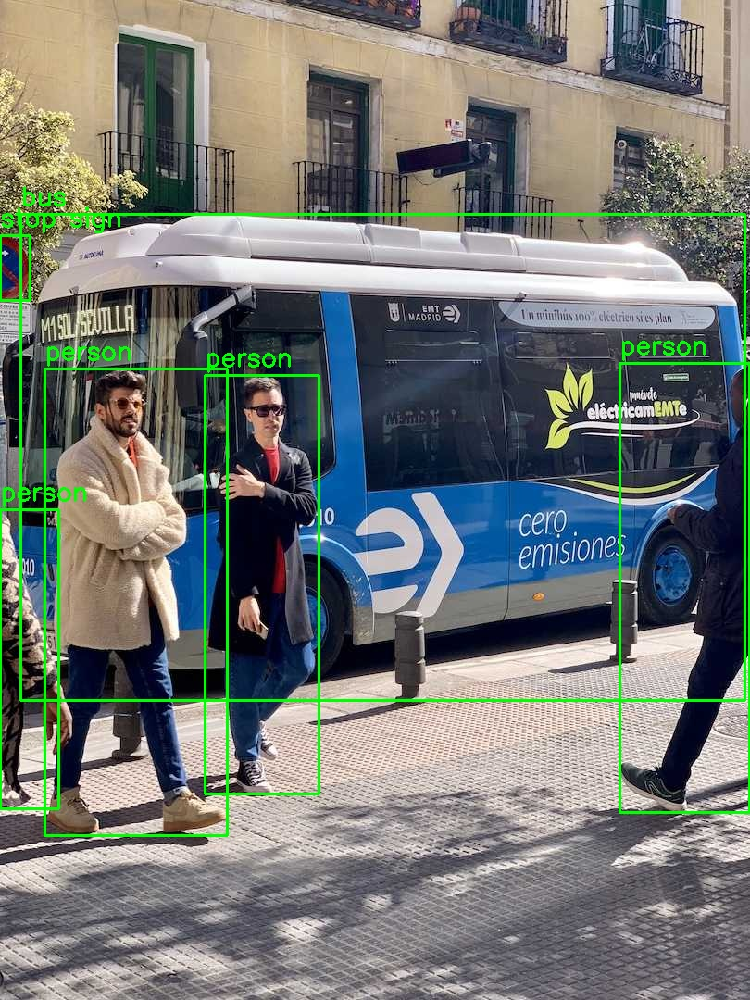
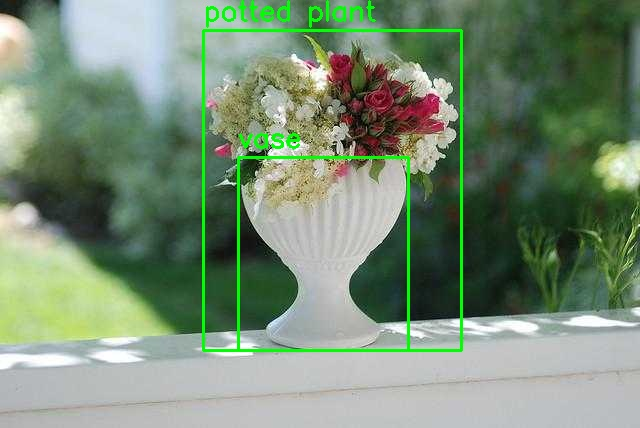

# JetBot Vision Perception with YOLO

**Short Description:**  
ROS2-based vision perception package for JetBot, utilizing YOLO models for real-time object detection and depth camera integration

### Setup
- [JetBot Vision Perception with YOLO Model Setup Guide](docs/setup.md#setup)
<br><br>

### Jetbot ROS2 yolo_detection
> **Note:**  
> The provided Docker image includes only the ROS2 source code—it does **not** come with ROS2 pre-installed or built.  
> On first-time launch inside the container, you **must manually build the workspace** with:  
> 
> ```bash
> cd /ros2_ws && colcon build
> ```
> 
> You'll also see this reminder printed by `run.sh` if the `/ros2_ws/install/setup.bash` file is missing.

- Usage:
  ```bash
  # Navigate to the source directory
  cd ../ros2_ws
  # Build the package
  colcon build
  # Source the setup file
  . install/setup.bash
  # Launch YOLO detection node
  ros2 launch jetbot_vision_perception yolo_detection.launch.py
  ros2 run jetbot_vision_perception yolo_detection
  ros2 run jetbot_vision_perception yolo_detection --ros-args -p model_path:=/data/yolov11n.engine
  ```
### Jetbot YOLO Image Detection Tool
A lightweight, standalone YOLO image‑inference tester located in the /app directory.
Useful for validating exported YOLO models (engine or onnx) without launching ROS2.
- Usage:
  ```bash
  # Navigate to the /app directory cd /app
  # Run YOLO image detection
  python3 YOLO_detect.py [image_file] --model_path=<path> --format=<format>
  # Alternative ROS2-style parameter syntax
  python3 YOLO_detect.py [image_file] -p model_path:=<path> --format=<format>
  # Display help
  python3 YOLO_detect.py -? | -help
  ```
- Examples:
  ```bash
  python3 YOLO_detect.py ../out/bus.jpg
  python3 YOLO_detect.py ../out/bus.jpg --model_path=/data/yolov11n.engine --format=engine
  python3 YOLO_detect.py ../out/bus.jpg -p model_path:=/data/yolov11n.pt --format=onnx

  ```
  <p float="left">
      
      
  </p>

### Jetbot YOLO Webcam Detection Tool
A real‑time YOLO webcam detection utility located in the /app directory.
This tool opens the specified webcam using OpenCV, performs YOLO inference on each frame, and displays the live annotated output.
Useful for quickly validating YOLO models (engine or onnx) with a live camera feed outside ROS2.
- Usage:
  ```bash
  # Navigate to the /app directory
  cd /app

  # Run YOLO webcam detection
  python3 YOLO_detection_webcam.py [webcam_id] --model_path=<path>

  # Alternative ROS2-style parameter syntax
  python3 YOLO_detection_webcam.py [webcam_id] -p model_path:=<path>

  # Display help
  python3 YOLO_detection_webcam.py -? | -help
  ```
  - Examples:
  ```bash
  python3 YOLO_detection_webcam.py
  python3 YOLO_detection_webcam.py 0 --model_path=/data/yolov11n.engine
  python3 YOLO_detection_webcam.py 0 -p model_path:=/data/yolov11n.pt
  ```
  > **Note**
  > - To find available webcam IDs, run: <br>
  >   ```bash
  >   v4l2-ctl --list-devices
  >   ```
  >  - To verify the webcam works properly:
  > ```bash
  >  python3 webcam_test.py [webcam_id]
  > ```

### Image Transport Republish (Compression & Decompression)

To reduce bandwidth when transmitting image topics, ROS 2 provides the image_transport package. You can republish raw image topics as compressed streams, and then decompress them back to raw for downstream nodes.

- Compressing a Topic <br>
  Use the raw → compressed pipeline to publish a compressed version of an existing image topic:
  ```bash
  ros2 run image_transport republish raw compressed \
    --ros-args \
    --remap in:=/yolo/overlay \
    --remap /out/compressed:=/yolo/in/compressed
  ```
- Decompressing a Topic <br>
  Use the compressed → raw pipeline to restore the compressed stream back to a raw image:
  ```bash
    ros2 run image_transport republish compressed raw \
    --ros-args \
    --remap __ns:=/yolo \
    --remap in:=/in/compressed \
    --remap out:=overlay_decompressed
  ```

  ### References
- https://www.jetson-ai-lab.com/tutorial_ultralytics.html
  - [YOLO 11](https://huggingface.co/Ultralytics/YOLO11/blob/365ed86341e7a7456dbc4cafc09f138814ce9ff1/yolo11n.pt)
- https://github.com/mgonzs13/yolo_ros
- https://docs.ultralytics.com/reference/engine/results/
